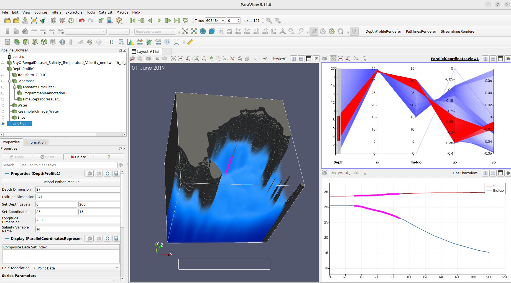
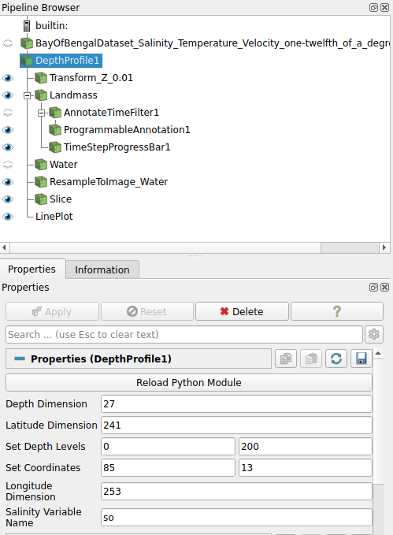
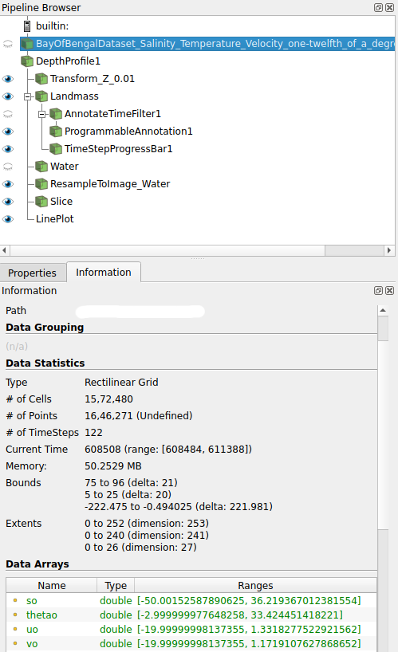
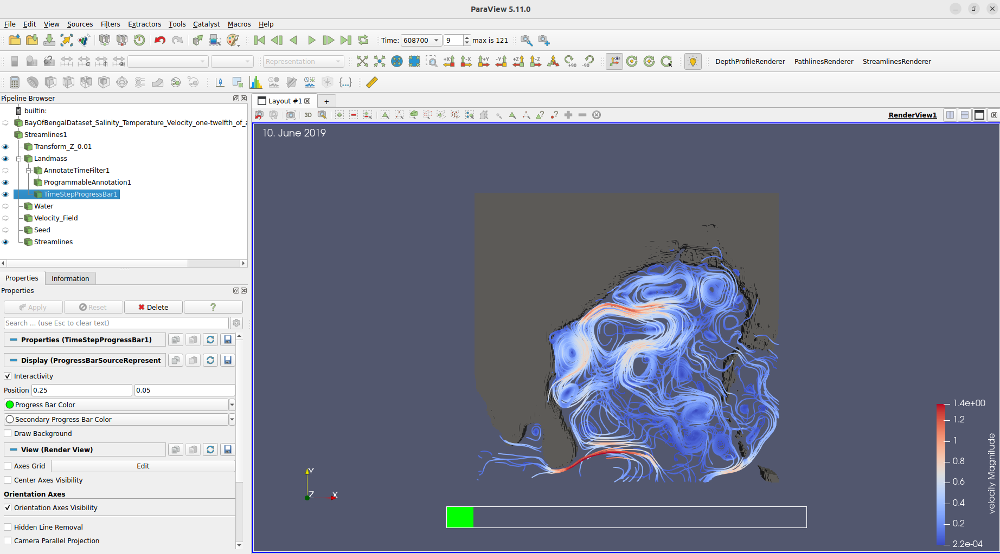
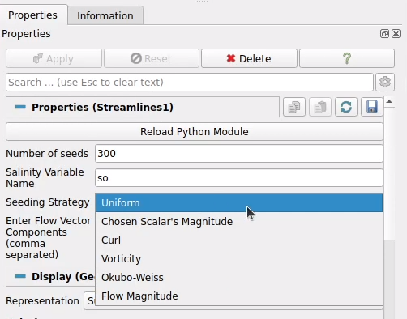
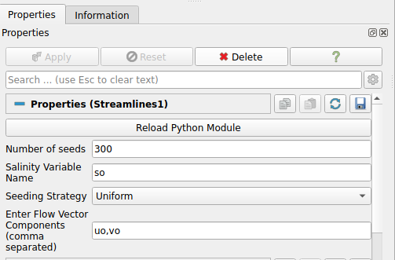
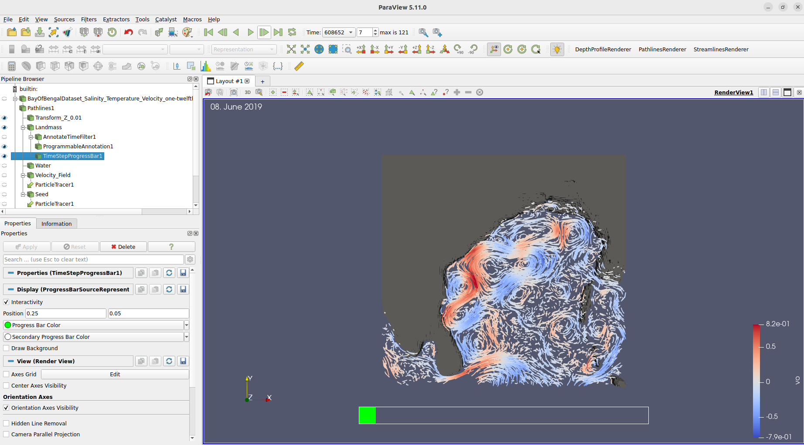

## pyParaOcean:
  - pyParaOcean is a set of filters built on top of Paraview to leverage its parallel computation capability.
  - To add pyParaOcean filters:
    - Tools -> Manage Plugins -> Load New -> pyParaOcean.py
    - Afterwards, filters will be available from: Filters -> pyParaOcean Filters

---

## pyParaOcean filters

## Depth Profile:

| &nbsp; |
|:--------------:|
|  |
| *Picture A - Depth Profile Filter* |

  - Oceanographers are interested in vertical sections of the dataset, i.e. depth slices, as they reveal the most important insights of the features like finding out low and high salinity over the desired location.
  - The Depth Profile filter has three interactive views: Render view, Line Plot view and Parallel Coordinates view.
  - With the help of this filter, users can view the vertical section of the dataset. Line Plot view shows values of variables such as Salinity as they are changing over depth. Parallel Coordinates view is very helpful in order to select a particular range of values and observe them in all the other views.
  - To apply Depth Profile filter:
    - Select Dataset in Pipeline Browser
    - Go to: Filters -> pyParaOcean Filter -> Depth Profile
    - Set Parameters in the Properties section
    - Click Apply
    - Also apply macro named ‘DepthProfileRenderer’ from Top-Right side
  - Note on Setting Parameters:
    - Users need to provide proper parameter values otherwise the filter may not work.
    - As shown in Picture B, users need to provide values of: Depth Dimension, Latitude Dimension and Longitude Dimension. These values can be obtained by selecting the dataset and looking for the ‘Extents’ section in the information tab as shown in Picture C.
    - Also, users need to provide which location to look for by providing Longitude and Latitude values. Users need to provide starting and ending depth values to probe the dataset as shown in Picture - B.
    - Users need to provide the name of the Salinity variable which is ‘so’ in this case. Dataset generally has the name of all variables.

| &nbsp; |
|:--------------:|
|  |
| *Picture B - Depth Profile Parameters* |

| &nbsp; |
|:--------------:|
|  |
| *Picture C - Dataset Information* |

---

## Streamlines:

| &nbsp; |
|:--------------:|
|  |
| *Picture D - Streamlines* |

  - To understand the behavior of particles over time, strategies like Streamlines and Pathlines are used.
  - Seeding plays a crucial role for those. For Streamlines and Pathlines, pyParaOcean provides different seeding strategies as shown in Picture - E.
  - Users also need to set different parameters before applying this filter.
  - To apply Streamlines filter:
    - Select Dataset in Pipeline Browser
    - Go to: Filters -> pyParaOcean Filter -> Streamlines
    - Set Parameters in the Properties section
    - Click Apply
    - Also apply a macro named ‘StreamlinesRenderer’ from Top-Right side.
  - Note on Setting Parameters:
    - Users need to provide proper parameter values otherwise the filter may not work.
    - As shown in Picture F, users need to provide values of: Number of Seeds, Salinity Variable Name, Seeding Strategy and Flow Vector Components.
    - Users need to provide the name of the Salinity variable which is ‘so’ in this case. Dataset generally has the name of all variables.
    - Users also need to provide the variable name of Horizontal Velocity which here is ‘uo’ and Vertical Velocity which is ‘vo’. Dataset generally has the name of all variables. Using these variables, this filter will be able to create a Flow Field and using it, filter will create Streamlines.

| &nbsp; |
|:--------------:|
|  |
| *Picture E - Seeding Strategies for Streamline filter* |

| &nbsp; |
|:--------------:|
|  |
| *Picture F - Streamline filter Parameters* |

---

## Pathlines:

| &nbsp; |
|:--------------:|
|  |
| *Picture G - Pathlines* |

  - Similar to Streamlines, user need to provide seeding strategy and number of seeds. Here, we follow particles as they move over time based on the velocity field. Particles will leave a trail behind.
  - To apply Pathlines filter:
    - Select Dataset in Pipeline Browser
    - Go to: Filters -> pyParaOcean Filter -> Pathlines
    - Set Parameters in the Properties section
    - Click Apply
    - Also apply macro named ‘PathlinesRenderer’ from Top-Right side
  - User may need to click on the next time step button below the menu bar.
  - Users need to provide proper parameter values otherwise the filter may not work.

---